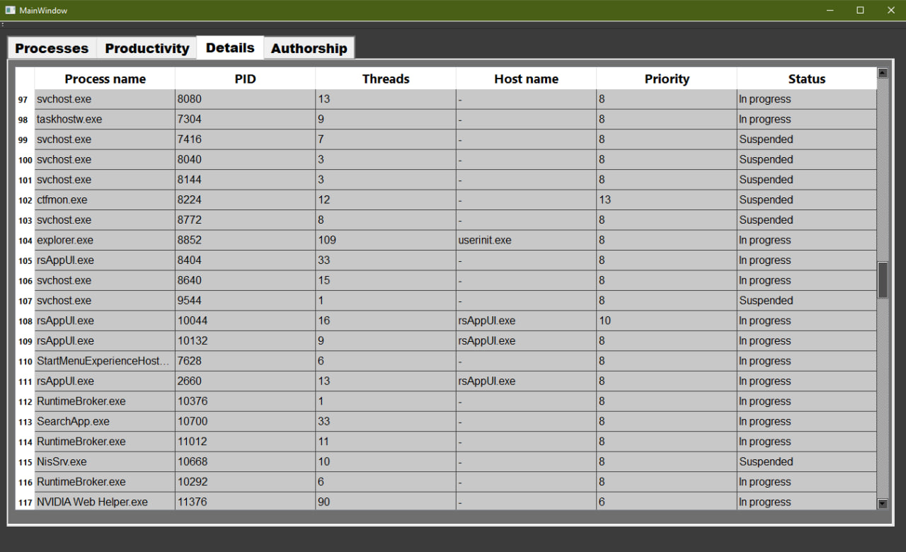

<h1 align="center">TaskManager-WinLite</h1>
<h2>What is it?</h2>

This program is a simple analog of the task manager for Windows. It provides information about the processes running in 
the system, as well as information about the use of certain system resources by the processes.

<h2>How does it work?</h2>

The program uses functions from the WinAPI libraries to obtain information about the processes running in the system, 
as well as to obtain information about the resources used by the processes and other information related to the processes, 
which you can see in the images below.

For example, the function

<code>double MainWindow::getExecStatus(HANDLE hProcess)
{
    DWORD exitCode;
    GetExitCodeProcess(hProcess, &exitCode); // 259 - still alive, else - terminated
    int execStatus = static_cast<int>(exitCode);
    if (execStatus < 0)
        return 0;
    else
        return execStatus;
}</code>

uses the <code>GetExitCodeProcess(hProcess, &exitCode);</code> function to get the process state. This is just one example 
of WinAPI functions that the program uses.

The program consists of three main pages: processes, performance, and details.

    <ul>
        <li>
            
<b>Processes:</b> Here you can view a list of processes running in the system in real time, as well as the percentage of 
            resources such as CPU time and RAM used by them. There are also buttons to select the mode of updating the list of processes: 
            automatic, which is the default, and refresh with a button if you need to interact with a process, for example, terminate it 
            using the button in the lower right corner of the window.

            

        </li>
        <li>
            
<b>Productivity:</b> On this page, you can view the percentage of system resources used by your processes in the form of graphs 
            that are updated in real time. To create the graph widgets, I used the QCustomPlot library.

            

        </li>
        <li>
            
Details: Here you can view more specific information about the processes, such as their PID, number of threads, priority, 
            and more.

            

        </li>
    </ul> 

<h2>Additional sources</h2>

    <ul>
        <li><a href="https://learn.microsoft.com/en-us/windows/win32/api">WinAPI</a>;</li>
        <li><a href="https://www.qcustomplot.com">QCustomPlot</a>.</li>
    </ul> 

